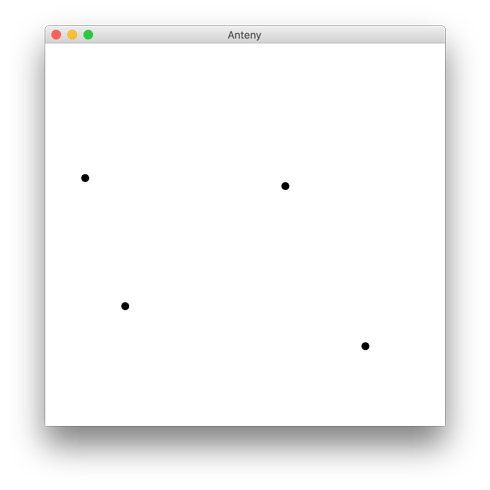

# MircoLocation
Java implementation of my own geometric approach for calculating position of a receiver based on signal strength and known position of antennas.

##### Algorithm description:
1. Calculating an abstract distance of given signals (for relativity) - using formula from the following paper: https://www.rn.inf.tu-dresden.de/dargie/papers/icwcuca.pdf
2. Scaling all the distances to the value where at least two of circles have one intersection point
3. Taking one intersection point from every pair of circles (that is closest to others) - if circles are not intersecting, the point is calculated basing on signal strength and distance between the circles.
4. The receiver position is the arithmetic mean of the points from the previous subsection

##### Algorithm visualization:

- Black dots - antennas
- Circles - signal
- Red dot - calculated location of a receiver
